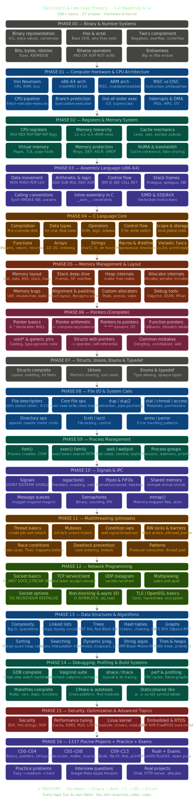

# 🚀 C MASTERY COMPLETE

## From Zero to Systems Expert | 500+ Topics | 24 Modules | 1337 Ready

---

---

## 📌 What is this?

Every folder is a learning module. **YOU add the code, notes, and resources.**

---

## 📂 Complete Module List

| Level | Module | Topics |
|-------|--------|--------|
| 00 | Binary Number Systems | Binary, Hex, Two's complement, Bitwise ops, Endianness, IEEE754 |
| 01 | CPU Architecture | x86/ARM, RISC vs CISC, Pipelines, Branch prediction, SIMD |
| 02 | Registers & Memory | General/Special registers, Cache hierarchy, MESI, TLB, Virtual memory, NUMA |
| 03 | Assembly Language | MOV/PUSH/POP, Jumps, CALL/RET, Stack frames, Calling conventions, SIMD/SSE/AVX |
| 04 | C Language Core | Compilation, Data types, Control flow, Functions, Arrays, Strings, Preprocessor |
| 05 | Memory Management | Memory layout, malloc/free, Allocators, Fragmentation, Valgrind, ASAN |
| 06 | Pointers | Pointer arithmetic, Double/Triple pointers, Function pointers, void pointers |
| 07 | Structs/Unions/Enums | Struct padding, Bit fields, Unions, Enums, typedef |
| 08 | File I/O | File descriptors, open/read/write/close, lseek, dup/dup2, sendfile |
| 09 | Process Management | fork/exec/wait, Zombies/Orphans, Daemons, CPU affinity |
| 10 | Signals & IPC | Signals, Pipes, Shared memory, Message queues, Semaphores, mmap |
| 11 | Multithreading | pthreads, Mutexes, Condition variables, RW locks, Thread pools |
| 12 | Network Programming | Sockets, TCP/UDP, select/poll/epoll, HTTP, TLS/SSL |
| 13 | Data Structures | Big O, Linked lists, Trees, Hash tables, Graphs, Tries |
| 14 | Algorithms | Sorting, Binary search, KMP, Dynamic programming, Dijkstra |
| 15 | Debugging & Profiling | GDB, Valgrind, strace, perf, Makefiles, CMake |
| 16 | Optimization & Security | Cache optimization, SIMD, Buffer overflow, ROP, Canaries |
| 17 | Linux Kernel | System calls, Schedulers, VFS, Device drivers, Kernel modules |
| 18 | Embedded Systems | ARM Cortex-M, GPIO, Interrupts, UART/SPI/I2C, FreeRTOS |
| 19 | 1337 Piscine Projects | 42 Norm rules, C00-C13, Rush projects, Custom printf |
| 20 | Practice Problems | Easy/Medium/Hard, Arrays, Pointers, Algorithms |
| 21 | Exams & Evaluation | Exam format, Common problems, Mock exams |
| 22 | Real World Projects | Mini shell, HTTP server, Custom malloc |
| 23 | Resources & References | Books, Courses, Cheat sheets |
| 24 | Tools & Setup | GCC, GDB, Valgrind, Docker, Git |

---

## 🎯 How to Use

1. Start from `00_Binary_Number_Systems/`
2. Go through each topic in order
3. Add your own code, notes, and resources to each folder
4. Track your progress

---

## ⭐ Star this repo

Save your journey from Zero to Systems Expert!

---

*Created for mastering C, low-level programming, and systems development*
